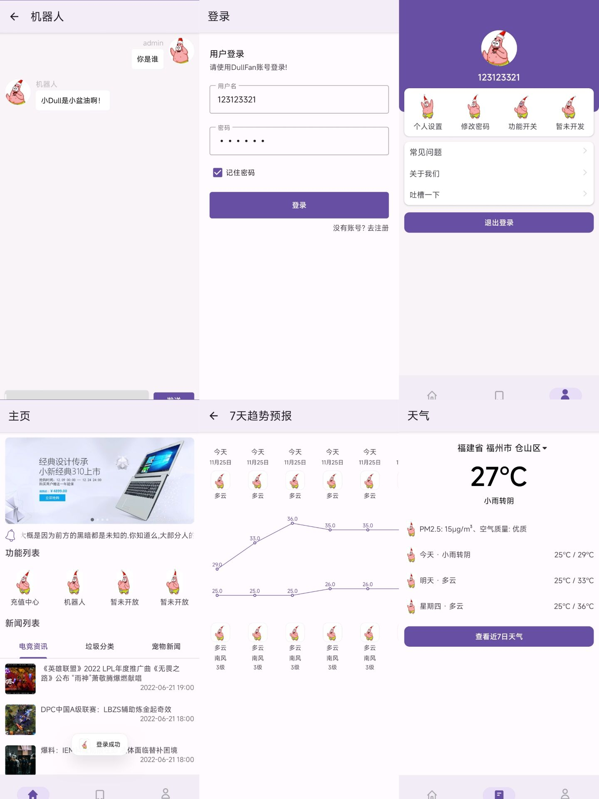

# MD3 学习Demo

## 介绍

主要功能有: 欢迎界面、登录、注册、主界面、天气、充值、用户管理、智能回答机器人

API是使用: https://www.tianapi.com/

## UI

## 特点

* 使用 Retrofit2 + 协程 完成网络请求
* BottomNavigationView + Lottie 实现底部导航栏
* 使用了Room
* 使用了Material3

## 联系我

* QQ：2928527233
* CSDN：https://blog.csdn.net/weixin_51298509
